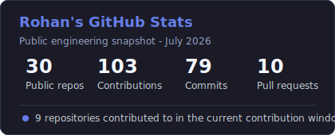
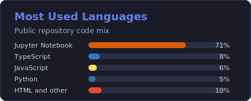

# Rohan Dhameja

High school student building software for AI, data, robotics, accessibility, and community impact.

**Open to collaborating on:** AI and ML | Robotics | Data Science | Full-Stack Development | Assistive Tech | Nonprofit Technology

## About

I am a student at Bellarmine College Preparatory in San Jose, CA, interested in
using computer science to solve practical problems for real people. My projects
usually sit at the intersection of machine learning, full-stack development,
data analysis, and social impact.

I like building things that move from idea to working prototype: tools for
nonprofits, apps for families and students, AI experiments, and systems that
make information easier to act on.

I am also a software developer on my FRC robotics team, Team 254, where I get to
work in a high-pressure engineering environment with teammates building,
testing, and improving competition robot software.

## Current Focus

- Contributing to FRC Team 254 as a software developer, learning how software,
  electrical, mechanical, and strategy work come together in competition
  robotics.
- Building civic and nonprofit technology with Salesforce Experience Cloud,
  Lightning Web Components, JavaScript, and Apex.
- Exploring machine learning for health, accessibility, safety, and financial
  decision support.
- Turning research ideas into usable applications with Python, React,
  TypeScript, Flask, and data science libraries.

## Selected Projects

| Project | What it does | Stack |
| --- | --- | --- |
| [Together We Will](https://github.com/RohanDhameja/TogetherWeWill) | Salesforce Experience Cloud site for a nonprofit, including public pages, donation and legal content, clean custom-domain routing, release docs, and validation scripts. | Salesforce LWR, LWC, Apex, JavaScript |
| [Inclusive Heart Learning Hub](https://github.com/RohanDhameja/inclusiveheart-learning-hub) | System architecture for managing STEM education programs, student enrollment, volunteers, and learning tracks. | Systems design, nonprofit operations |
| [LineGuard](https://github.com/RohanDhameja/LineGuard) | Vegetation detection near power lines to identify possible wildfire risks using imagery and computer vision. | Python, OpenCV, AI |
| [ASD Comorbidity Analysis](https://github.com/RohanDhameja/asd-comorbidity-analysis-using-ai) | Machine learning analysis of socioeconomic factors and comorbidities in children with autism, using explainable AI techniques. | Python, Jupyter, SHAP, ML |
| [BuddyConnect](https://github.com/RohanDhameja/BuddyConnect) | Mobile app concept for connecting parents of children with special needs for peer support, meetups, and community. | React Native, TypeScript, Supabase |
| [Project CleanLoom](https://github.com/RohanDhameja/Project-CleanLoom) | Affordable lint-control concept for weaving workshops, focused on practical constraints in small workspaces. | HTML, prototyping |
| [Stock Trading Analyzer](https://github.com/RohanDhameja/stock-trading-analyzer) | Full-stack app for analyzing historical stock data and dynamic buy/sell levels. | Flask, React, Python |

## Technical Toolkit

- **Languages:** Python, JavaScript, TypeScript, Java, HTML/CSS
- **Frontend:** React, React Native, Astro, Lightning Web Components
- **Backend and platforms:** Flask, Supabase, Salesforce Experience Cloud, Apex
- **Data and AI:** Pandas, NumPy, scikit-learn, OpenCV, SHAP, Jupyter
- **Robotics:** FRC software development, robot systems, team engineering
- **Workflow:** Git, GitHub, CLI tooling, release checklists, validation scripts

## What I Care About

- Building useful tools, not just demos.
- Making technology accessible to families, students, nonprofits, and local
  communities.
- Learning in public through projects, documentation, and iteration.
- Combining software engineering with empathy, research, and real-world
  constraints.

## Project Pattern

Most of my work follows a simple loop:

1. Find a concrete problem.
2. Build a small working prototype.
3. Test it with real users or realistic data.
4. Document what works, what breaks, and what should improve next.

## GitHub Stats

  
  

  

| Signal | What to look at |
| --- | --- |
| Robotics and team engineering | Software developer on FRC Team 254, contributing in a competition robotics environment. |
| Recent production work | [Together We Will](https://github.com/RohanDhameja/TogetherWeWill), a Salesforce Experience Cloud site with release docs and validation tooling. |
| AI and data projects | [LineGuard](https://github.com/RohanDhameja/LineGuard), [ASD Comorbidity Analysis](https://github.com/RohanDhameja/asd-comorbidity-analysis-using-ai), and [Stock Trading Analyzer](https://github.com/RohanDhameja/stock-trading-analyzer). |
| Community-focused apps | [BuddyConnect](https://github.com/RohanDhameja/BuddyConnect), [The Village](https://github.com/RohanDhameja/TheVillage), and [Inclusive Heart Learning Hub](https://github.com/RohanDhameja/inclusiveheart-learning-hub). |
| Languages visible across public work | Python, JavaScript, TypeScript, Java, HTML/CSS, Apex, and Jupyter notebooks. |

The cards above are repo-hosted snapshots built from public GitHub data. The
contribution graph below this README remains the best live view of recent
commits and project activity.

## Contact

I am always interested in thoughtful collaborations around AI, education,
accessibility, nonprofit technology, and tools that help communities work
better.

- Email: [rdhameja09@gmail.com](mailto:rdhameja09@gmail.com)
- LinkedIn: [Rohan Dhameja](https://www.linkedin.com/in/rohan-dhameja)
- Medium: [@rohanD_HS](https://medium.com/@rohanD_HS)
